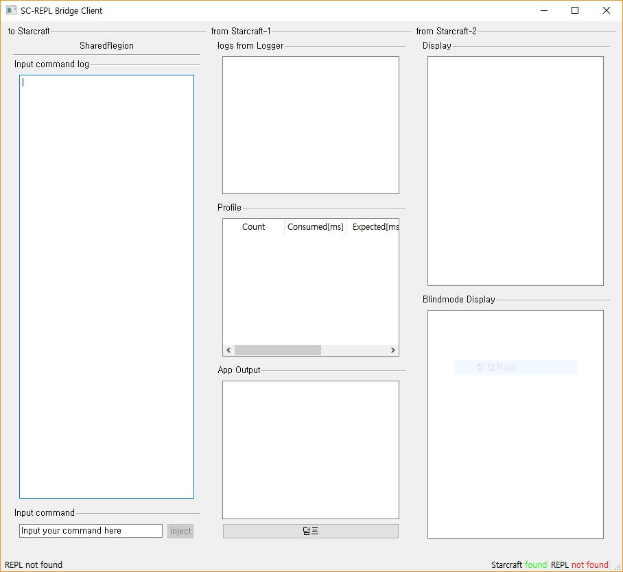

# SC-REPL Bridge Client

SC-REPL Bridge Client is a GUI tool that communicate with SC-REPL-applied-map based games.

Check [wiki](https://github.com/mighty1231/screpl/wiki/Bridge) to get description of SC-REPL Bridge.

## Screenshot

## How to build

* Install [QT](https://www.qt.io)
    * version recommended: >= 5.14.2
    * built system recommended: `MSVC 2017 32-bit`
    * `QT Creator` version recommended: >= 4.12.0
* Open the project `bridge.pro` with `QT Creator`
* Build with `ctrl+r`

## Executable
* If you do not want to build yourself, you may use executables built on my desktop on [here](https://github.com/mighty1231/screpl/releases).
    * Built under Windows 10, QT 5.14.2 MSVC 2017 32-bit.

